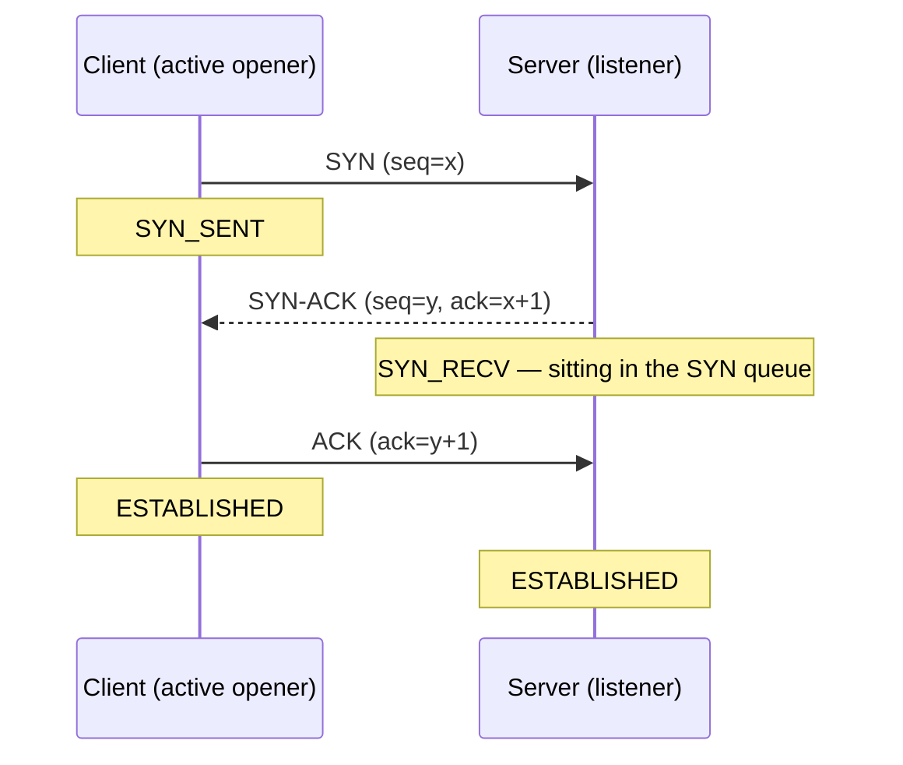
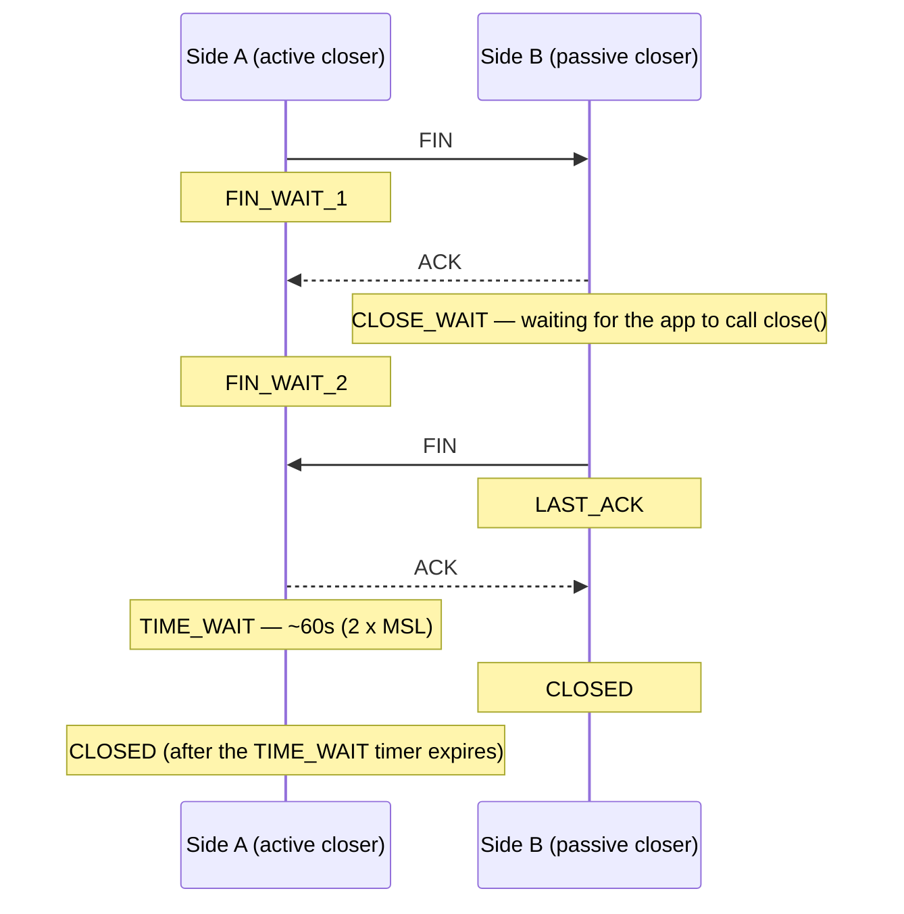

If a box feels "connection-y" — slow to accept new clients, running out of file descriptors, or just acting weird under load — three `ss` counters will usually point you at the culprit before you touch a single log file:

```bash
ss -tan state time-wait  | wc -l      # closing too much: pool your connections
ss -tan state close-wait | wc -l      # leaking fds: your bug, in your error paths
ss -tan state syn-recv   | wc -l      # SYN queue filling: flood, or backlog too small
```

Each of these numbers maps to a specific point in the TCP connection lifecycle. To make sense of them, it helps to walk through that lifecycle end to end: how a connection is born (the three-way handshake) and how it dies (the four-way close).

## Opening a connection: the three-way handshake



1. **SYN** — the client picks an initial sequence number and asks to open a connection. At this point the client is in **SYN_SENT**.
2. **SYN-ACK** — the server acknowledges the client's SYN and sends its own SYN. Between step 1 and step 3, the server-side socket sits in **SYN_RECV**, parked in the kernel's SYN queue waiting for the final ACK.
3. **ACK** — the client acknowledges the server's SYN. Both sides move to **ESTABLISHED** and can now exchange data.

### Why `syn-recv` count matters

A large, sustained `SYN_RECV` count means step 3 isn't completing at the rate step 1 is happening. Two very different causes produce the same symptom:

- **SYN flood** — spoofed source IPs send SYNs and simply never send the final ACK back. This is a classic DoS pattern. Check source IP diversity/randomness and whether `net.ipv4.tcp_syncookies` is kicking in.
- **Backlog too small** — a legitimate burst of real clients arrives faster than your listener's queue (`listen()` backlog, `net.core.somaxconn`, `net.ipv4.tcp_max_syn_backlog`) can drain, so new SYNs get dropped and retried.

Distinguish the two before you touch any sysctl — raising the backlog on a real flood just buys the attacker more of your memory.

## Closing a connection: the four-way close



Closing a TCP connection takes two independent FIN/ACK pairs, one per direction, because either side can still have data in flight when it decides to stop sending:

1. Side A sends **FIN** (I'm done sending) and moves into `FIN_WAIT_1`.
2. Side B's kernel immediately replies with **ACK**, and side B's socket moves into **CLOSE_WAIT** — it stays there until side B's *application code* calls `close()` on the socket. Side A, having received that ACK, moves to `FIN_WAIT_2`.
3. When side B's app finally closes the socket, side B sends its own **FIN** and moves to `LAST_ACK`.
4. Side A acknowledges with the final **ACK** and moves into **TIME_WAIT**, where it waits 2 x MSL (about 60 seconds on Linux) before fully releasing the socket, in case the last ACK was lost and B needs it retransmitted. Side B, upon receiving the final ACK, closes immediately.

### Why `close-wait` count matters

CLOSE_WAIT is entirely under your application's control — the kernel has already done its part. A high or growing count is a leak in *your* code: an error path that returns early without closing the connection, a missing `finally`/`defer`, or a library that doesn't release sockets on exception. Left alone, this exhausts file descriptors and the process eventually can't accept new connections. Fix: audit error-handling paths for missing cleanup, not sysctls.

### Why `time-wait` count matters

TIME_WAIT is normal and expected for whichever side closes first — but a very high count usually means you're opening and tearing down connections far faster than necessary instead of reusing them. Fix the architecture (HTTP keep-alive, database connection pooling, upstream keepalive on your load balancer), rather than reaching for `net.ipv4.tcp_tw_reuse` as a first move.

## Quick reference

| State | Which side | Root cause when high | Where to look |
|---|---|---|---|
| `SYN_RECV` | Server (listener) | SYN flood, or backlog too small | source IP diversity, `tcp_syncookies`, backlog sysctls |
| `CLOSE_WAIT` | Whoever received the FIN first | App bug — socket never closed | your error-handling / cleanup paths |
| `TIME_WAIT` | Whoever closed first (active closer) | Opening/closing connections too fast | connection pooling, keep-alive |

## The three commands, together

```bash
ss -tan state time-wait  | wc -l      # closing too much: pool your connections
ss -tan state close-wait | wc -l      # leaking fds: your bug, in your error paths
ss -tan state syn-recv   | wc -l      # SYN queue filling: flood, or backlog too small
```

Run all three before you start digging through application logs. `TIME_WAIT` points at your own connection-reuse habits, `CLOSE_WAIT` points at a bug in your own app, and `SYN_RECV` points at something happening to your listener from the network side — either an attack or an undersized queue. Knowing which bucket you're in tells you whether to change code, change config, or call your upstream provider.

References: [string-wise.com](https://string-wise.com/)