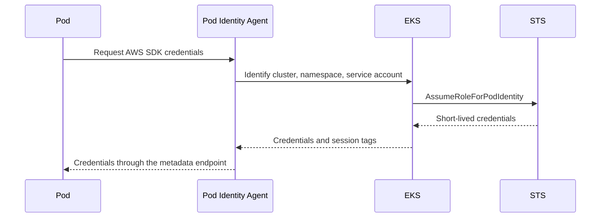

An application running in Amazon EKS should receive only the AWS permissions it
needs. Giving every worker node a broad instance role works at first, but it
turns one compromised pod into a problem for every workload on that node.

EKS Pod Identity lets a Kubernetes `ServiceAccount` use a dedicated IAM role.
The application still uses the normal AWS SDK credential chain; it does not
need long-lived access keys in a Secret or in its container image.

This walkthrough connects a service account to an IAM role that can list one
S3 bucket. The same pattern works for other AWS APIs, provided the role policy
is kept narrow.

## Why Pod Identity instead of IRSA?

The older IAM Roles for Service Accounts (IRSA) integration uses the cluster's
OIDC provider. Each cluster has a different OIDC issuer, so a shared role must
contain trust relationships for every cluster that may use it. That becomes
awkward across many clusters and can eventually run into IAM trust-policy size
limits.

EKS Pod Identity moves the association into EKS itself. The mapping is stored
in AWS with `create-pod-identity-association`, so the service account does not
need an IAM annotation and the role trust policy does not contain a cluster
specific OIDC URL.

The request path looks like this:



The Pod Identity Agent runs as a DaemonSet on the worker nodes. EKS uses the
association and the pod's service account to request short-lived credentials;
the application does not call STS directly.

## Prerequisites

You need:

- An EKS cluster and permission to create add-ons and pod identity associations.
- The AWS CLI configured for the account and region containing the cluster.
- Worker nodes supported by the EKS Pod Identity Agent.
- `kubectl` configured for the cluster.

Set a few shell variables so the commands below are easy to adapt:

```bash
export AWS_REGION=ap-southeast-2
export CLUSTER_NAME=my-eks-cluster
export ROLE_NAME=s3-reader
export SERVICE_ACCOUNT=s3-reader
export NAMESPACE=default
export BUCKET_NAME=my-private-bucket
```

## 1. Install the Pod Identity Agent

The agent is an EKS add-on. Install it once per cluster:

```bash
aws eks create-addon \
	--cluster-name "$CLUSTER_NAME" \
	--addon-name eks-pod-identity-agent \
	--region "$AWS_REGION"
```

Wait for the add-on to become active before testing an application:

```bash
aws eks describe-addon \
	--cluster-name "$CLUSTER_NAME" \
	--addon-name eks-pod-identity-agent \
	--region "$AWS_REGION" \
	--query 'addon.status' \
	--output text
```

The command should return `ACTIVE`. For a cluster managed with Terraform or
another infrastructure tool, manage the add-on there instead of creating it
manually.

## 2. Create a trust policy

Create `trust-policy.json` with the Pod Identity service principal:

```json
{
	"Version": "2012-10-17",
	"Statement": [
		{
			"Effect": "Allow",
			"Principal": {
				"Service": "pods.eks.amazonaws.com"
			},
			"Action": [
				"sts:AssumeRole",
				"sts:TagSession"
			]
		}
	]
}
```

Unlike an IRSA trust policy, this does not reference an OIDC provider. Create
the role and capture its ARN:

```bash
aws iam create-role \
	--role-name "$ROLE_NAME" \
	--assume-role-policy-document file://trust-policy.json

ROLE_ARN=$(aws iam get-role \
	--role-name "$ROLE_NAME" \
	--query 'Role.Arn' \
	--output text)
```

## 3. Attach the smallest useful permission policy

For a quick test, an AWS-managed read-only S3 policy is convenient:

```bash
aws iam attach-role-policy \
	--role-name "$ROLE_NAME" \
	--policy-arn arn:aws:iam::aws:policy/AmazonS3ReadOnlyAccess
```

For a real workload, prefer a customer-managed policy limited to the required
bucket and actions. For example, this policy allows listing one bucket and
reading objects below one prefix:

```json
{
	"Version": "2012-10-17",
	"Statement": [
		{
			"Effect": "Allow",
			"Action": "s3:ListBucket",
			"Resource": "arn:aws:s3:::my-private-bucket"
		},
		{
			"Effect": "Allow",
			"Action": "s3:GetObject",
			"Resource": "arn:aws:s3:::my-private-bucket/app/*"
		}
	]
}
```

The bucket policy, KMS key policy, and any organization-level SCPs can still
deny a request. Pod Identity only supplies credentials; it does not bypass the
rest of IAM evaluation.

## 4. Create the Kubernetes service account

There is no `eks.amazonaws.com/role-arn` annotation here. The association is
created through the EKS API in the next step.

```yaml
apiVersion: v1
kind: ServiceAccount
metadata:
	name: s3-reader
	namespace: default
```

Apply it and confirm that the name and namespace match the values used in the
association:

```bash
kubectl apply -f service-account.yaml
kubectl get serviceaccount "$SERVICE_ACCOUNT" --namespace "$NAMESPACE"
```

## 5. Create the Pod Identity association

This is the binding between the EKS service account and the IAM role:

```bash
aws eks create-pod-identity-association \
	--cluster-name "$CLUSTER_NAME" \
	--namespace "$NAMESPACE" \
	--service-account "$SERVICE_ACCOUNT" \
	--role-arn "$ROLE_ARN" \
	--region "$AWS_REGION"
```

The association is exact: a pod must run in the specified namespace and use
the specified service account. It is not enough for a pod to have a similar
label or name.

You can inspect the association later with:

```bash
aws eks list-pod-identity-associations \
	--cluster-name "$CLUSTER_NAME" \
	--region "$AWS_REGION"
```

## 6. Run a test pod

Create a pod that explicitly selects the service account:

```yaml
apiVersion: v1
kind: Pod
metadata:
	name: s3-identity-test
	namespace: default
spec:
	serviceAccountName: s3-reader
	restartPolicy: Never
	containers:
		- name: aws-cli
			image: amazon/aws-cli:latest
			command: ["sh", "-c"]
			args:
				- aws sts get-caller-identity && aws s3 ls s3://my-private-bucket/app/
```

Apply the manifest and inspect the output:

```bash
kubectl apply -f test-pod.yaml
kubectl wait --for=jsonpath='{.status.phase}'=Succeeded pod/s3-identity-test --timeout=90s
kubectl logs s3-identity-test
```

The first command in the container should return the ARN of `s3-reader`, not
the worker node role. The S3 command should succeed only for resources allowed
by that role's policy.

## Troubleshooting checklist

If the pod cannot obtain credentials, check the path in this order:

1. The `eks-pod-identity-agent` add-on is `ACTIVE` and its DaemonSet has a pod
	 on the node running the workload.
2. The pod uses the expected `serviceAccountName` and namespace.
3. The EKS association points to the correct role ARN, cluster, namespace, and
	 service account.
4. The IAM trust policy contains both `sts:AssumeRole` and `sts:TagSession` for
	 `pods.eks.amazonaws.com`.
5. The role policy allows the exact AWS action and resource being tested.
6. The bucket, KMS key, or organization SCP is not adding an explicit deny.

Useful commands include:

```bash
kubectl get pods -n kube-system -l app.kubernetes.io/name=eks-pod-identity-agent
kubectl describe pod s3-identity-test
kubectl logs s3-identity-test
```

Do not troubleshoot this by adding access keys to a Kubernetes Secret. That
would replace a short-lived, workload-scoped identity with credentials that
must be rotated and protected manually.

## Remove the example resources

Delete the test association before deleting the role. First find the
association ID:

```bash
aws eks list-pod-identity-associations \
	--cluster-name "$CLUSTER_NAME" \
	--region "$AWS_REGION"
```

Then remove the association, test pod, service account, attached policy, and
role when they are no longer needed. Keep the add-on installed if other
workloads in the cluster use Pod Identity.

## Summary

EKS Pod Identity makes pod-to-IAM mapping an EKS resource instead of embedding
cluster-specific OIDC details in every role trust policy. The operational
sequence is small:

- Install the Pod Identity Agent add-on.
- Create an IAM role trusted by `pods.eks.amazonaws.com`.
- Attach a least-privilege policy.
- Create a Kubernetes service account.
- Associate the service account with the role through EKS.
- Verify the caller identity from a pod.

The important security boundary remains the IAM policy. Pod Identity makes the
credential delivery cleaner, but it does not make a broad role safe. Start with
the smallest set of actions and resources the workload needs, then expand it
only when a measured requirement appears.

References: [EKS Pod Identities](https://docs.aws.amazon.com/eks/latest/userguide/pod-identities.html), [Create a Pod Identity association](https://docs.aws.amazon.com/cli/latest/reference/eks/create-pod-identity-association.html)
