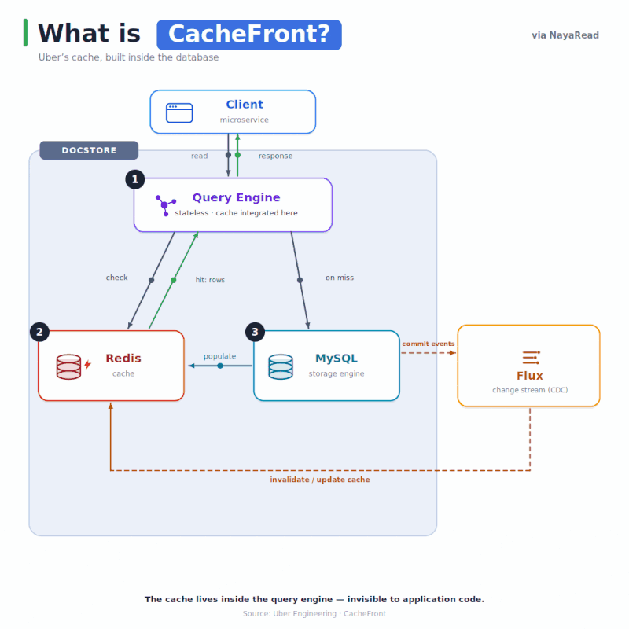

Uber's Docstore database runs on MySQL and serves tens of millions of requests per second.

But storage has a limit. At some point, reads cannot be made any faster, and adding more machines to the fleet only increases the cost.

Reads massively outnumbered writes in Docstore. To achieve the required throughput, individual teams started implementing their own caching. Each team had to provision a Redis cluster and build a cache-invalidation strategy, adding unnecessary complexity for Docstore users.

Uber decided to build an integrated caching mechanism inside the Docstore ecosystem.

## Docstore architecture

Docstore's architecture has two major components:

- **Stateless query engine:** Serves reads and writes to clients.
- **Storage engine:** Handles replication, transactions, concurrency control, and load management.

The query engine is a natural place to integrate a caching layer because it already serves reads and writes to clients.

## How the integrated cache works

### Read path: cache-aside

1. A read request arrives.
2. The query engine checks Redis first.
3. Cached rows are streamed back immediately.
4. Only missing rows are fetched from MySQL, asynchronously written back to Redis, and streamed to the client.

### Keeping the cache consistent

A plain TTL, five minutes by default, may still serve stale entries. To keep the cache consistent, Redis needs to know about every database update. Uber uses a change-data-capture (CDC) style architecture: every Docstore commit emits an event, and a Redis consumer listens to those events and updates the cache.

### Eliminating a race condition

Both the read and write paths can update the cache, which can cause an old value to overwrite a newer one. The fix is to store the MySQL timestamp with each row and update the cache only when the incoming row is newer.

### Surviving failures

- **Circuit breakers:** If a Redis node starts failing, requests short-circuit to the database instead of waiting for a timeout.
- **Adaptive timeouts:** Redis timeouts auto-tune to P99.99 latency, so the slowest 0.01% of lookups fall back to the database instead of stalling the entire request.

## Results

The integrated cache reduced P75 latency by 75% and P99.9 latency by more than 67%.

One of Uber's largest use cases now serves more than 6 million requests per second with a 99% cache-hit rate.

The same workload would have required approximately 60,000 CPU cores from the storage engine. With CacheFront, Uber serves approximately 99.9% cache hits using only 3,000 Redis cores.

## Reference

[How Uber Serves Over 40 Million Reads per Second Using an Integrated Cache](https://www.uber.com/us/en/blog/how-uber-serves-over-40-million-reads-per-second-using-an-integrated-cache/)